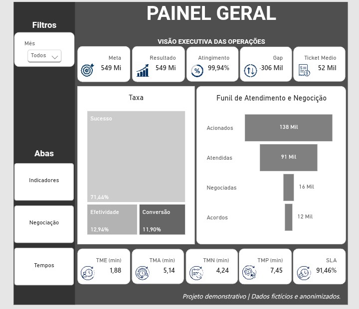
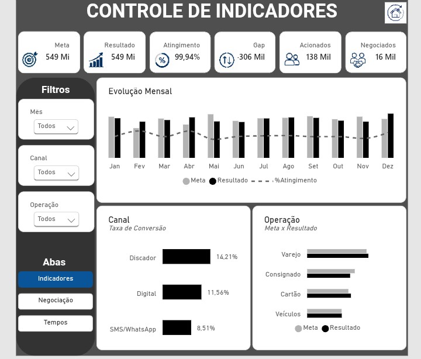
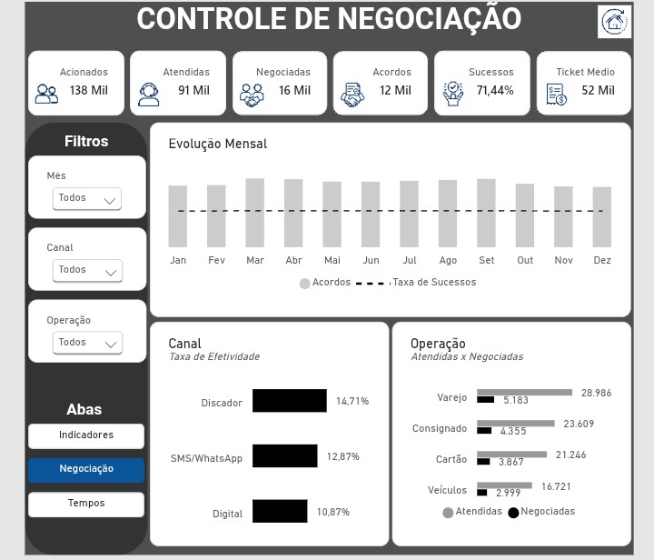
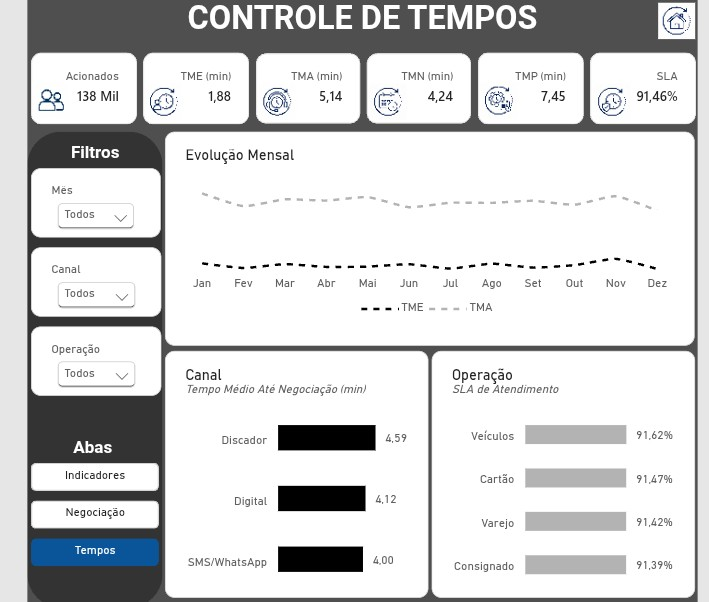

# 📊 Painel Executivo de Análise de Crédito

Dashboard desenvolvido em Power BI para análise de crédito, recuperação e acompanhamento de indicadores operacionais.

O projeto apresenta uma visão executiva dos principais indicadores relacionados à carteira de crédito, permitindo explorar resultados, negociações e desempenho operacional.

---

## 🎯 Objetivo

Desenvolver um painel executivo capaz de transformar dados operacionais de crédito em informações visuais para apoiar a análise e o acompanhamento dos resultados.

O dashboard foi estruturado para facilitar a identificação de:

- Volume e valor das operações
- Indicadores de recuperação
- Resultados de negociação
- Desempenho ao longo do tempo
- Principais indicadores operacionais

---

## 📈 Visões do Dashboard

### 01. Visão Geral

Visão executiva com os principais indicadores consolidados do negócio.

---

### 02. Indicadores

Análise dos principais indicadores de desempenho e recuperação.

---

### 03. Negociação

Detalhamento dos resultados relacionados às negociações realizadas.

---

### 04. Tempos

Análise dos indicadores relacionados ao tempo e desempenho operacional.

---

## 🛠️ Ferramentas utilizadas

- **Power BI**
- **DAX**
- **Power Query**
- **Excel**
- Modelagem e tratamento de dados
- Criação de indicadores e métricas

---

## 🔎 Principais análises

O projeto permite explorar os dados por diferentes perspectivas, facilitando a análise de:

- Recuperação de crédito
- Volume de operações
- Valores negociados
- Indicadores de desempenho
- Evolução temporal
- Eficiência operacional

---

## 📚 Desenvolvimento

Este projeto foi desenvolvido como parte do meu portfólio profissional na área de **Dados e Business Intelligence**, com foco na aplicação prática de Power BI, tratamento de dados, modelagem e construção de indicadores.

---

## ⚠️ Observação

Os dados apresentados neste projeto são utilizados exclusivamente para fins de demonstração e portfólio, não representando dados reais ou informações confidenciais de empresas ou clientes.

---

## 📁 Arquivo do projeto
O arquivo .pbix está disponível neste repositório para consulta e exploração do modelo desenvolvido no Power BI Desktop.
Dados: fictícios e utilizados exclusivamente para fins demonstrativos.

---

## 👤 Autor

**Ivan Santos**

Analista de Dados / BI

[GitHub](https://github.com/89ivansantos)
